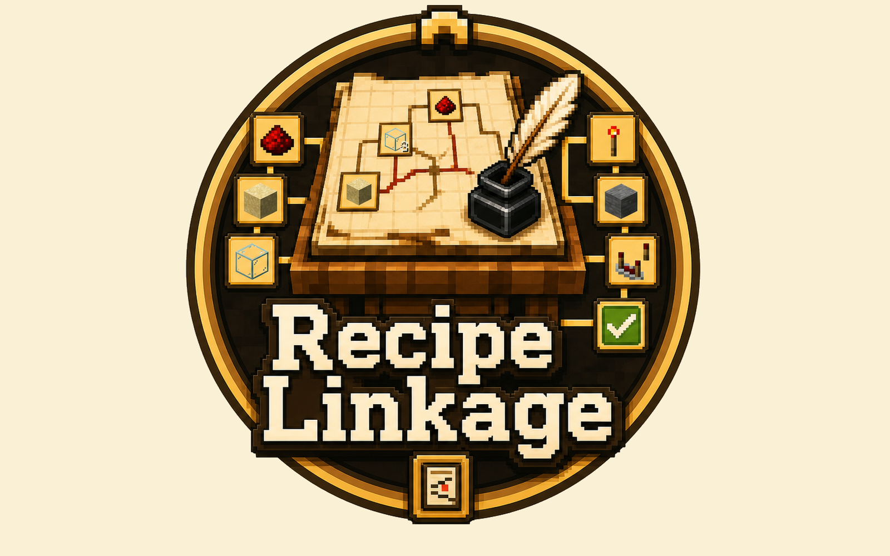

# Recipe Linkage

**Recipe Linkage** 是一个面向 Minecraft NeoForge 1.21.1 整合包的配方研究台模组。

它新增一个研究台方块和可复用的研究样本。整合包作者通过数据包定义“材料关联”研究图，玩家在研究台中提交相关材料，打通路线并解锁对应阶段。

## 核心特点

- 模组本体不内置研究内容，全部研究由数据包载入
- 线索以物品图标呈现，不依赖文字谜面
- 样本生成研究图后会永久保存进度
- 玩家需要选择更省材料的路线，而不是盲目试物品
- 研究完成后可联动 AStages 授予阶段
- 可选支持 JEI 查询和 Sophisticated Backpacks 背包取材

## 玩法流程

玩家把已绑定的研究样本放入研究台后，样本会生成固定路线图。

当前可提交节点会显示半透明物品图标和数量。玩家提交材料后，该节点变为已到达节点，并显露相邻节点。当已到达路线连接到终点时，研究完成。终点本身不需要提交物品。

研究完成后的阶段发放、右键领取是否消耗样本，都可以通过配置文件调整。

## 给整合包作者

Recipe Linkage 不内置任何研究样本。你可以通过数据包定义研究，再用任务、战利品、命令、KubeJS 或其他系统发放已绑定的样本。

研究节点支持：

- 具体物品
- 物品标签
- 提交数量
- 可选自定义数据匹配
- 手动坐标，或自动布局
- 带概率的边，用于生成不同路线
- Minecraft 文本组件形式的本地化标题

这适合用来制作配方门槛、科技线、魔法发现、章节里程碑，或任何希望玩家从材料关系中理解进度的整合包内容。

### 配置说明

整合包和服务器可以在 `config/recipe_linkage-common.toml` 中调整行为：

- `autoAwardStageOnCompletion`：默认 `true`，研究完成后自动授予配置的阶段。
- `consumeCompletedSampleOnClaim`：默认 `false`，控制右键领取已完成样本时是否消耗样本。
- `revealCompletedGraph`：默认 `false`，控制研究完成后是否显示完整生成路线图。
- `enableSophisticatedBackpackMaterials`：默认 `true`，允许提交材料时从玩家携带的 Sophisticated Backpacks 中扣除匹配物品。

## 阶段与辅助联动

- **AStages**：作为研究完成后的阶段产物。
- **JEI**：鼠标悬停研究节点时，可以使用 JEI 查询所需材料。
- **Sophisticated Backpacks**：启用后，提交材料时可以从玩家携带的背包中扣除匹配物品。

AStages 负责承接研究完成后的进度产物。JEI 和 Sophisticated Backpacks 属于可选的体验辅助联动。

## 注意事项

- 研究台不会消耗研究样本。
- 取出样本不会重置研究图。
- 已提交材料不会退还。
- 样本生成路线后不会重新随机。
- 模组本体不提供默认研究样本；整合包需要自行通过数据包和发放方式提供内容。

## 数据包路径

研究 JSON 文件放在：

```text
data/<namespace>/recipe_linkage/researches/<path>.json
```

数据包载入的研究会直接以已绑定样本的形式出现在 Recipe Linkage 创造模式物品栏中。需要用命令发放时，也可以使用同样的自定义数据：

```mcfunction
/give @p recipe_linkage:research_sample[minecraft:custom_data={RecipeLinkage:{Research:"modpack:basic_optics"}}]
```

### AStages + KubeJS 配方绑定示例

下面示例把红石比较器配方绑定到研究 JSON 里的 `target_stage: "basic_optics"`。研究完成后，Recipe Linkage 会授予这个 AStages 阶段；AStages 的 KubeJS API 会让没有该阶段的玩家无法使用对应配方。

脚本放在 `kubejs/server_scripts/recipe_linkage_stages.js`：

```js
// Requires: AStages, KubeJS
AStages.addRestrictionForRecipe(
  'recipe_linkage:basic_optics_comparator',
  'basic_optics',
  'minecraft:crafting',
  'minecraft:comparator'
)
```

如果使用下面复杂示例里的 `target_stage: "redstone_lens"`，就把脚本中的 `basic_optics` 改成 `redstone_lens`。

### 最简自动布局示例

这个示例没有写任何 `x` 和 `y` 字段。Recipe Linkage 会自动布局，让整体尽量呈现左侧起点、右侧终点的路线图。

保存为 `data/modpack/recipe_linkage/researches/basic_optics.json`：

```json
{
  "target_stage": "basic_optics",
  "target": "comparator",
  "min_distance_to_target": 3,
  "nodes": [
    { "id": "sand", "tag": "minecraft:sand", "count": 8 },
    { "id": "glass", "item": "minecraft:glass", "count": 3 },
    { "id": "redstone", "item": "minecraft:redstone", "count": 4 },
    { "id": "quartz", "item": "minecraft:quartz", "count": 2 },
    { "id": "comparator", "item": "minecraft:comparator" }
  ],
  "edges": [
    { "from": "sand", "to": "glass" },
    { "from": "glass", "to": "redstone" },
    { "from": "redstone", "to": "quartz" },
    { "from": "quartz", "to": "comparator" }
  ]
}
```

不写 `initial_nodes` 时，样本生成研究图时会自动选择一个合适的初始节点。不写 `chance` 时，该边的生成概率默认为 `1.0`。

### 全部自定义的复杂示例

这个示例展示了本地化标题、固定坐标、多个初始节点、tag 输入、自定义数据输入和带概率的边。

保存为 `data/modpack/recipe_linkage/researches/redstone_lens.json`：

```json
{
  "title": {
    "translate": "research.modpack.redstone_lens",
    "fallback": "Redstone Lens"
  },
  "target_stage": "redstone_lens",
  "target": "comparator",
  "min_distance_to_target": 4,
  "generation_attempts": 96,
  "initial_nodes": ["sand", "copper"],
  "nodes": [
    { "id": "sand", "tag": "minecraft:sand", "count": 8, "x": 5, "y": 58 },
    { "id": "copper", "item": "minecraft:copper_ingot", "count": 3, "x": 8, "y": 78 },
    { "id": "glass", "item": "minecraft:glass", "count": 3, "x": 25, "y": 52 },
    { "id": "redstone", "item": "minecraft:redstone", "count": 4, "x": 42, "y": 30 },
    { "id": "quartz", "item": "minecraft:quartz", "count": 2, "x": 55, "y": 42 },
    { "id": "note", "item": "minecraft:paper", "count": 1, "nbt": "{\"recipe_linkage_note\":\"optics\"}", "x": 32, "y": 80 },
    { "id": "spyglass", "item": "minecraft:spyglass", "count": 1, "x": 60, "y": 72 },
    { "id": "daylight_detector", "item": "minecraft:daylight_detector", "count": 1, "x": 76, "y": 56 },
    { "id": "comparator", "item": "minecraft:comparator", "count": 1, "x": 94, "y": 50 }
  ],
  "edges": [
    { "from": "sand", "to": "glass", "chance": 1.0 },
    { "from": "glass", "to": "redstone", "chance": 0.85 },
    { "from": "redstone", "to": "quartz", "chance": 0.9 },
    { "from": "quartz", "to": "comparator", "chance": 0.8 },
    { "from": "glass", "to": "note", "chance": 0.65 },
    { "from": "note", "to": "spyglass", "chance": 0.75 },
    { "from": "copper", "to": "spyglass", "chance": 0.9 },
    { "from": "spyglass", "to": "daylight_detector", "chance": 0.8 },
    { "from": "daylight_detector", "to": "comparator", "chance": 0.7 },
    { "from": "redstone", "to": "daylight_detector", "chance": 0.55 }
  ]
}
```

标题文本可以放在资源包或 KubeJS assets 中，例如 `assets/modpack/lang/zh_cn.json`：

```json
{
  "research.modpack.redstone_lens": "红石透镜研究"
}
```

完整字段说明可参考随模组提供的数据包格式文档和原版示例数据包。
